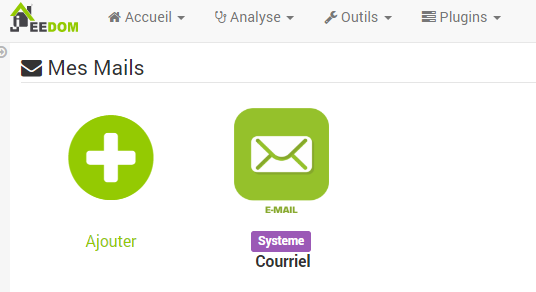

Das Plugin wird zum Versenden von E-Mails verwendet.

Plugin Konfiguration
===

Nachdem sie das Plugin installiert haben, aktivieren sie es einfach. Dieses
Plugin hat keine besondere Konfiguration :

Geräte Konfiguration
===

Die Konfiguration von Mail-Geräten ist über das Menü Plugin
verfügbar :

So sieht die Mail-Plugin-Seite aus (hier schon mit 1 Mail, Sie können mit der Schaltfläche "Hinzufügen" beliebig viele hinzufügen) :

> **Tip**
>
> Wie an vielen Stellen in Jeedom kann mit dem Mauszeiger ganz links, ein
> Menü mit Schnellzugriff aufgerufen werden (Sie können in Ihrem Profil
> immer sichtbar einstellen).  

Sobald Sie eines davon anklicken, erhalten Sie :

Sie finden hier die ganze Konfiguration von ihrem Gerät :

-   **E-Mail Gerätename** : Name Ihres E-Mail Gerätes

-   **Eltern-Objekt** : zeigt das übergeordnete Objekt an, zu dem es gehört
    Gerät

-   **Aktivieren**: ermöglicht es Ihnen, Ihr Gerät zu aktivieren

-   **Sichtbar** : macht Ihr Gerät auf dem Armaturenbrett sichtbar

-   **Absender Name** : Name des E-Mail-Absenders (z.B. Jeedom)

-   **Absender E-Mail** : E-Mail des Absenders (z.B. <jeedom@moi.fr>)

-   **Versandart** : Versandart der E-Mail :

    -   SMTP : üblichste Methode zum Senden von E-Mails

    -   Sendmail

    -   Qmail

    -   Mail()\[PHP Function\] : verwendet die [Standard-PHP-
        Sendefunktion,
        window="\_blank"](http://fr.php.net/manual/fr/function.mail.php),
        erfordert die Konfiguration des Betriebssystems

Abgesehen von der SMTP-Option erfordern die anderen Optionen die
Konfiguration des Betriebssystems (Linux), um zu funktionieren. Mit anderen
Worten funktioniert nur die SMTP-Funktion, die anderen sind für Experten
reserviert, die, wenn sie dies wünschen, diese Optionen selbst konfigurieren
können.

Wenn SMTP ausgewählt wurde, erscheint auf der Registerkarte die
SMTP-Konfiguration. Sie können dann die Anmeldedaten des E-Mail-Servers
eingeben, den Sie verwenden möchten.

Hier sind einige Beispiele für die wichtigsten E-Mail-Diensteanbieter :

-   **Gmail**

    -   SMTP Server : smtp.gmail.com

    -   SMTP Port : 587

    -   SMTP Sicherheit : TLS

-   **Hotmail**

    -   SMTP Server : smtp.live.com

    -   SMTP Port : 587

    -   SMTP Sicherheit : TLS

-   **iCloud**

    -   SMTP Server : smtp.me.com

    -   SMTP Port : 25

-   **Yahoo.com**

    -   SMTP Server : smtp.mail.yahoo.com

    -   SMTP Port : 465

    -   SMTP Sicherheit : SSL

Die Felder « SMTP Benutzer » und « SMTP Passwort » entsprechen den
Anmeldedaten Ihres E-Mail-Accounts.

Auf der Registerkarte '"Befehle" können Sie Befehle hinzufügen, die den
E-Mail-Adressen entsprechen, an die Sie E-Mails mit Jeedom senden
möchten :

-   **Name** : Name des Befehls

-   **E-Mail** : Die E-Mail-Adresse, an die die Nachricht gesendet werden soll. Sie können mehrere einsetzen, indem Sie sie mit "," trennen.

-   **Erweiterte Konfiguration** (Zahnrad Symbol) : Ermöglicht
    die erweiterte Konfiguration des Befehls anzuzeigen (Informationen,
    Widget usw.)

-   **Test** : Ermöglicht es, den Befehl zu testen.

-   **Löschen** (- Zeichen) : Ermöglicht den Befehl zu löschen.

Dieses Plugin funktioniert wie ein Modul, d.h. sobald es gespeichert wurde,
erscheint es in der Liste der Aktionen oder Befehle. Es ist somit sehr einfach,
es beispielsweise bei der Erstellung von Szenarien zu verwenden.

In einem Szenario müssen Sie nach der Auswahleiner Aktion den Titel und die Nachricht eingeben.

> **Wichtig**
>
> Bei Gmail müssen Sie ein spezifisches Passwort für die Anwendung
> angeben : Mein Konto ⇒ Login und Sicherheit ⇒ Mit Google verbinden ⇒
> Anwendungskennwörter

> **Tip**
>
> Das HTML-Format wird vom Szenario-Editor für den Nachrichtentext
> unterstützt.

> **Tip**
>
> Denken Sie daran, alle Änderungen zu speichern.
