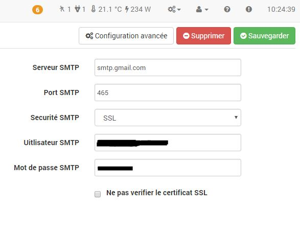

Plugin permettant d’envoyer des mails.

Configuration du plugin 
===

Après avoir installé le plugin, il vous suffit de l’activer. Ce plugin
n’a aucune configuration particulière :

Configuration des équipements 
===

La configuration des équipements Mail est accessible à partir du menu
plugin :

Voilà à quoi ressemble la page du plugin Mail (ici avec déjà 1 mail,
vous pouvez en mettre autant que vous voulez avec le bouton "Ajouter") :

> **Tip**
>
> Comme à beaucoup d’endroits sur Jeedom, placer la souris tout à gauche
> permet de faire apparaître un menu d’accès rapide (vous pouvez, à
> partir de votre profil, le laisser toujours visible).

Une fois que vous cliquez sur l’un d’eux, vous obtenez :

Aquí encontrará toda la configuración de su dispositivo:

-   **Nom de l’équipement mail** : nom de votre équipement mail

-   **Objeto padre** : especifica el objeto padre al que pertenece
    l’équipement

-   **Activer** : permet de rendre votre équipement actif

-   **Visible** : rend votre équipement visible sur le dashboard

-   **Nom expéditeur** : nom de l’expéditeur du mail (ex : Jeedom)

-   **Mail expéditeur** : mail de l’expéditeur (ex : <jeedom@moi.fr>)

-   **Mode d’envoi** : mode d’envoi du mail :

    -   SMTP : mode le plus courant pour l’envoi de mail

    -   Sendmail

    -   Qmail

    -   Mail()\[PHP Function\] : utilise la [fonction d’envoi standard
        de PHP,
        window="\_blank"](http://fr.php.net/manual/fr/function.mail.php),
        nécessite de configurer le système d’exploitation

Hormis l’option SMTP, les autres options nécessitent la configuration de
l’OS (Linux) pour pouvoir fonctionner. Autrement dit, de base seule la
fonction SMTP fonctionne, les autres sont réservées aux experts qui
pourront, s’ils le souhaitent, paramétrer eux-mêmes ces options.

L’onglet configuration SMTP permet de renseigner les informations du
serveur d’email que vous voulez utilisé.

Voici quelques exemples pour les principaux fournisseurs de services
email :

-   **Gmail**

    -   Serveur SMTP : smtp.gmail.com

    -   Port SMTP : 587

    -   Sécurité SMTP : TLS

-   **Hotmail**

    -   Serveur SMTP : smtp.live.com

    -   Port SMTP : 587

    -   Sécurité SMTP : TLS

-   **iCloud**

    -   Serveur SMTP : smtp.me.com

    -   Port SMTP : 25

-   **Yahoo.com**

    -   Serveur SMTP : smtp.mail.yahoo.com

    -   Port SMTP : 465

    -   Sécurité SMTP : SSL

Les champs « Utilisateur SMTP » et « Mot de passe SMTP » correspondent
aux identifiants de votre compte email.

A partir de l’onglet "Commandes", vous pouvez ajouter des commandes qui
correspondent aux adresses email auxquelles vous souhaitez pouvoir
envoyer des emails avec Jeedom :

-   **nom** : nom de la commande

-   **email** : l’addresse email à laquelle envoyer le message

-   **configuration avancée** (petites roues crantées) : permet
    d’afficher la configuration avancée de la commande (méthode
    d’historisation, widget, etc.)

-   **tester** : permet de tester la commande,

-   **supprimer** (signe -) : permet de supprimer la commande.

Ce plugin fonctionne comme un module, c’est-à-dire qu’une fois
sauvegardé, il apparaît dans la liste des actions ou commandes. Il est
ainsi très simple de l’utiliser lors de la création de scénarios par
exemple.

Dans un scénario, une fois sélectionné dans une action, il faudra saisir
le titre et le message.

> **Important**
>
> Avec Gmail il faut donner un mot de passe spécifique pour
> l’application : Mon compte ⇒ connexion et sécurité ⇒ Se connecter à
> Google ⇒ Mots de passe d’application

> **Tip**
>
> Le format HTML est supporté par l’éditeur de scénario pour le corps
> des messages.

> **Tip**
>
> Pensez à sauvegarder toutes les modifications.
