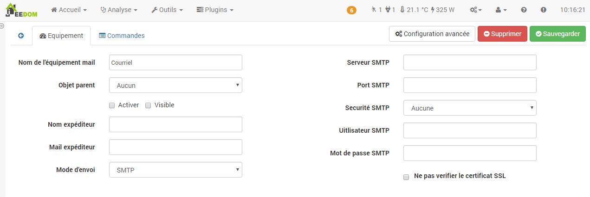

# Complemento de correo

Complemento para enviar correos electrónicos.

# Configuración del plugin 

Después de instalar el complemento, solo necesita activarlo. Este complemento no tiene una configuración particular :

# Configuración del equipo 

Se puede acceder a la configuración del equipo de correo desde el menú de complementos :

Así es como se ve la página del complemento de correo (aquí con 1 correo electrónico ya, puede agregar tantos como desee con el "Agregar") :

Una vez que haces clic en uno de ellos, obtienes :

Aquí encontrarás toda la configuración de tu equipo :

-   **Nombre del equipo de correo** : nombre del correo de su equipo
-   **Objeto padre** : indica el objeto padre al que pertenece el equipo
-   **Activar** : activa su equipo
-   **Visible** : hace que su equipo sea visible en el tablero
-   **Nombre del remitente** : nombre del remitente del correo electrónico (ej : Jeedom)
-   **Remitente de correo** : correo electrónico del remitente (ex : <jeedom@moi.fr>)
-   **Método de envío** : método de enviar el correo electrónico :
    -   SMTP : modo más común para enviar correo
    -   Sendmail
    -   Qmail
    -   Mail()\[Función PHP \] : use la [función de envío estándar de PHP, window = "\_ blank"](http://fr.php.net/manual/fr/function.mail.php), requiere configurar el sistema operativo

Además de la opción SMTP, las otras opciones requieren la configuración del sistema operativo (Linux) para poder funcionar. En otras palabras, básicamente solo funciona la función SMTP, los otros están reservados para expertos que pueden, si lo desean, configurar estas opciones ellos mismos.

La pestaña de configuración SMTP le permite ingresar la información del servidor de correo electrónico que desea usar.

Estos son algunos ejemplos de los principales proveedores de servicios de correo electrónico :

-   **Gmail**
    -   Servidor SMTP : smtp.gmail.com
    -   Puerto SMTP : 587
    -   Seguridad SMTP : TLS
-   **Hotmail**
    -   Servidor SMTP : smtp.live.com
    -   Puerto SMTP : 587
    -   Seguridad SMTP : TLS
-   **iCloud**
    -   Servidor SMTP : smtp.me.com
    -   Puerto SMTP : 25
-   **Yahoo.com**
    -   Servidor SMTP : smtp.mail.yahoo.com
    -   Puerto SMTP : 465
    -   Seguridad SMTP : SSL

Les champs « Utilisateur SMTP » et « Mot de passe SMTP » correspondent aux identifiants de votre compte E-mail.

Desde la pestaña "Pedidos", puede agregar pedidos que correspondan a las direcciones de correo electrónico a las que desea poder enviar correos electrónicos con Jeedom :

-   **Nombre** : Nombre de la orden
-   **E-mail** : la dirección de correo electrónico para enviar el mensaje. Puedes poner varios separándolos con ,
-   **Configuración avanzada** (ruedas con muescas pequeñas) : se usa para mostrar la configuración avanzada del comando (método de historización, widget, etc.)
-   **Probar** : Se usa para probar el comando,
-   **Borrar** (signo -) : permite eliminar el comando.

Este complemento funciona como un módulo, es decir, una vez guardado, aparece en la lista de acciones o comandos. Por lo tanto, es muy simple usarlo al crear escenarios, por ejemplo.

En un escenario, una vez seleccionado en una acción, deberá ingresar el título y el mensaje.

> **Importante**
>
> Con Gmail, debe proporcionar una contraseña específica para la aplicación : Mi cuenta ⇒ conexión y seguridad ⇒ Conéctese a Google ⇒ Contraseñas de aplicación

> **Punta**
>
> El editor de escenarios admite el formato HTML para el cuerpo de los mensajes.

> **Punta**
>
> Recuerde guardar todos los cambios.
